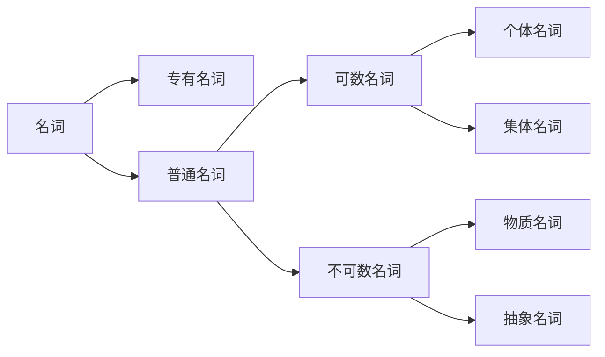

`more` 英语笔记
<!-- more -->

# 名词

```mermaid
graph LR
A[名词]
    A -->B[专有名词]
    A -->C[普通名词]
		C -->D[可数名词]
		C -->E[不可数名词]
			D -->F[个体名词]
			D -->G[集体名词]
			E -->H[物质名词]
			E -->I[抽象名词]
```

# 英语笔记
<PDF url="/assets/英文四级抱佛脚200词.pdf" height="900px" zoom="90" />
 
<PDF url="/assets/英语真题.pdf" height="900px" zoom="90" />